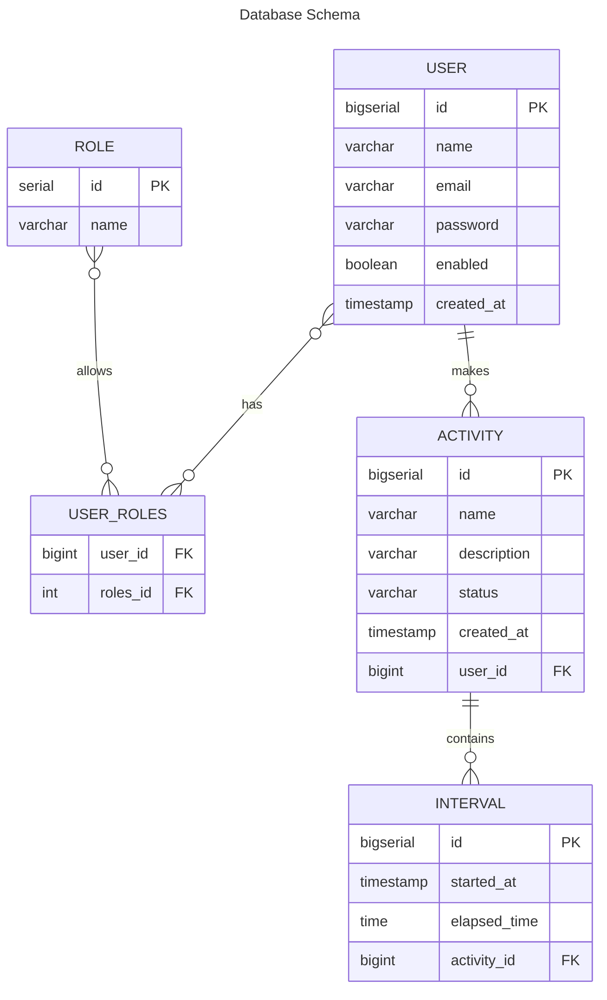

<h1 align="center">Time Manager API</h1>


## :book: Resumo do projeto

Time Manager API é uma aplicação para auxiliar no gerenciamento de tempo gasto em atividades (ex. esse projeto).

## :hammer: Funcionalidades

- `Atividades`
    - `cadastrar`: Cadastro de atividade através de um POST para **/activities** com as informações de nome e descrição da
      atividade no corpo da requisição.
  ```json
    {
      "name": "nome da atividade",
      "description": "descrição da atividade"  
    }
  ```

    - `Buscar`: Busca paginada de atividades através de um GET para **/activities**.
  ```json
    {
      "content": [
        {
          "id": 1,
          "name": "nome da atividade",
          "description": "descrição da atividade",
          "createdAt": "2022-09-22 16:02:12",
          "status": "ACTIVE"
        },
        {
          "id": 2,
          "name": "outra atividade",
          "description": "descrição da outra atividade",
          "createdAt": "2022-09-24 10:33:36",
          "status": "CONCLUDED"
        }
      ],
      "pageable": {
        "sort": {
          "empty": false,
          "unsorted": false,
          "sorted": true
        },
        "offset": 0,
        "pageNumber": 0,
        "pageSize": 20,
        "paged": true,
        "unpaged": false
      },
      "last": true,
      "totalPages": 1,
      "totalElements": 2,
      "size": 20,
      "number": 0,
      "sort": {
        "empty": false,
        "unsorted": false,
        "sorted": true
      },
      "first": true,
      "numberOfElements": 2,
      "empty": false
    }
  ```
    - `Atualizar`: Atualizar atividade através de um PUT para **/activities/{ID}**, onde *{ID}* é o identificador da atividade.

  ```json
    {
      "name": "novo nome da atividade",
      "description": "nova descrição da atividade"  
    }
  ```

    - `Deletar`: Deletar atividade através de um DELETE para **/activities/{ID}**, onde *{ID}* é o identificador da atividade.
    - `Atualizar Status`: Atualizar status da atividade (ACTIVE ou CONCLUDED), através de um PATCH para **/activities/{ID}**, onde *{ID}* é o identificador da atividade.
  ```json
    {
      "status" : "concluded"  
    }
  ```
- `Intervals`
  - `cadastrar`: Cadastro de intervalo de execução de uma atividade através de POST para **/activities/{activityID}/intervals**, onde *{activityID}* é o identificador da ativiadade.
  ```json
    {
      "startedAt": "2022-09-25T10:40:00",
      "elapsedTime": "00:40:00"  
    }
  ```
  - `Buscar`: Busca paginada dos intervals de determinada atividade através de um GET para **/activities/{activityID}/intervals**, onde *{activityID}* é o identificador da ativiadade..
  ```json
    {
      "content": [
        {
          "id": 1,
          "startedAt": "2022-09-25T10:40:00",
          "elapsedTime": "00:40:00"  
        },
        {
          "id": 2,
          "startedAt": "2022-09-26T09:00:00",
          "elapsedTime": "00:25:00"  
        }
      ],
      "pageable": {
        "sort": {
          "empty": false,
          "unsorted": false,
          "sorted": true
        },
        "offset": 0,
        "pageNumber": 0,
        "pageSize": 10,
        "paged": true,
        "unpaged": false
      },
      "last": true,
      "totalPages": 1,
      "totalElements": 2,
      "size": 10,
      "number": 0,
      "sort": {
        "empty": false,
        "unsorted": false,
        "sorted": true
      },
      "first": true,
      "numberOfElements": 2,
      "empty": false
    }
  ```
  - `Deletar`: Deletar interval através de um DELETE para **/activities/{activityID}/intervals/{activityID}**, onde *{activityID}* é o identificador da atividade e *{intervalID}* é o identificador do intervalo.

## Diagramas

### Diagrama entidade relacionamento



### Diagrama de classes

```mermaid
---
    title: Business layer
---
classDiagram
    class UserService {
        <<interface>>
        findByUsername(String username) UserDetails
        findUserDetailsById(long id) UserDetails
        save(SignupRequest signupRequest) UserResponse
    }
    class IntervalService {
        <<interface>>
        create(long activityId, IntervalRequest requestBody) IntervalResponse
        find(long activityId, Pageable pageable) Page~IntervalResponse~
        delete(long activityId, long intervalId) void
    }
    class ActivityService {
        <<interface>>
        find(Pageable pageable) Page~ActivityResponse~
        findById(long id) Activity
        create(ActivityRequest activityRequest) ActivityResponse
        update(long id, ActivityRequest activityRequest) void
        deleteActivityById(long id) void
        updateStatusById(long id, UpdateStatusRequest updateStatusRequest) void
    }
    class SigninService {
        <<interface>>
        signin(LoginRequest loginRequest) TokenResponse
    }
    class TokenService {
        <<interface>>
    }

    class ModelMapper {
        <<interface>>
    }
    class AuthenticationManager {
        <<interface>>
    }

    class UserServiceImpl {
        -UserRepository userRepository
        -PasswordEncoder passwordEncoder
        -ModelMapper mapper
        +findByUsername(String username) UserDetails
        +findUserDetailsById(long id) UserDetails
        +save(SignupRequest signupRequest) UserResponse
        -getRole() Role
    }
    class SigninServiceImpl {
        -AuthenticationManager authManager
        -TokenService tokenService
        +signin(LoginRequest loginRequest) TokenResponse
    }
    class ActivityServiceImpl {
        -ActivityRepository activityRepository
        +find(Pageable pageable) Page~ActivityResponse~
        +findById(long id) Activity
        +create(ActivityRequest activityRequest) ActivityResponse
        +update(long id, ActivityRequest activityRequest) void
        +deleteActivityById(long id) void
        +updateStatusById(long id, UpdateStatusRequest updateStatusRequest) void
        -findByIdAndNotDeleted(long id) Activity
        -getCurrentUser() User
    }
    class IntervalServiceImpl {
        -ActivityService activityService
        -IntervalRepository intervalRepository
        +create(long activityId, IntervalRequest requestBody) IntervalResponse
        +find(long activityId, Pageable pageable) Page~IntervalResponse~
        +delete(long activityId, long intervalId) void
        -findById(long id) Interval
    }

    class ActivityRepository {
        <<interface>>
    }
    class UserRepository {
        <<interface>>
    }
    class IntervalRepository {
        <<interface>>
    }

    UserServiceImpl ..|> UserService
    UserServiceImpl --> UserRepository
    UserServiceImpl --> ModelMapper
    SigninServiceImpl ..|> SigninService
    SigninServiceImpl --> AuthenticationManager
    SigninServiceImpl --> TokenService
    ActivityServiceImpl ..|> ActivityService
    ActivityServiceImpl --> ActivityRepository
    IntervalServiceImpl ..|> IntervalService
    IntervalServiceImpl --> ActivityService
    IntervalServiceImpl --> IntervalRepository
```


## :toolbox: Tecnologias

- `Intellij`
- `Java 17`
- `Maven`
- `Spring Boot, Spring MVC, Spring Data JPA, Spring Security`
- `JWT`
- `Docker`
- `PostgreSQL`
- `Flyway`
- `Lombok`
- `Bean Validation`
- `Postman`
- `JUnit 5`
- `Mockito`
- `TestContainer`
